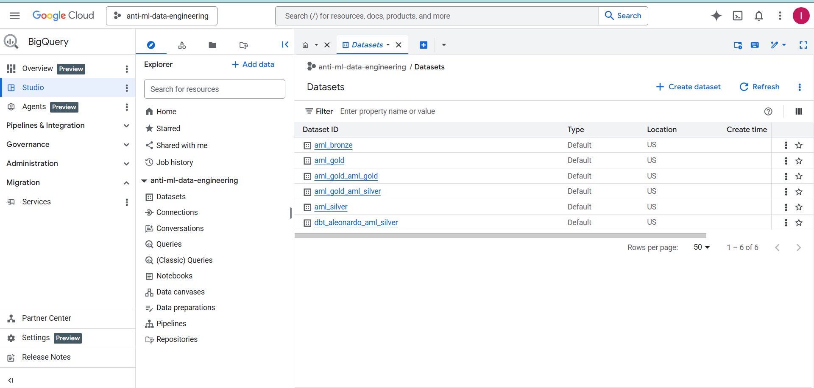
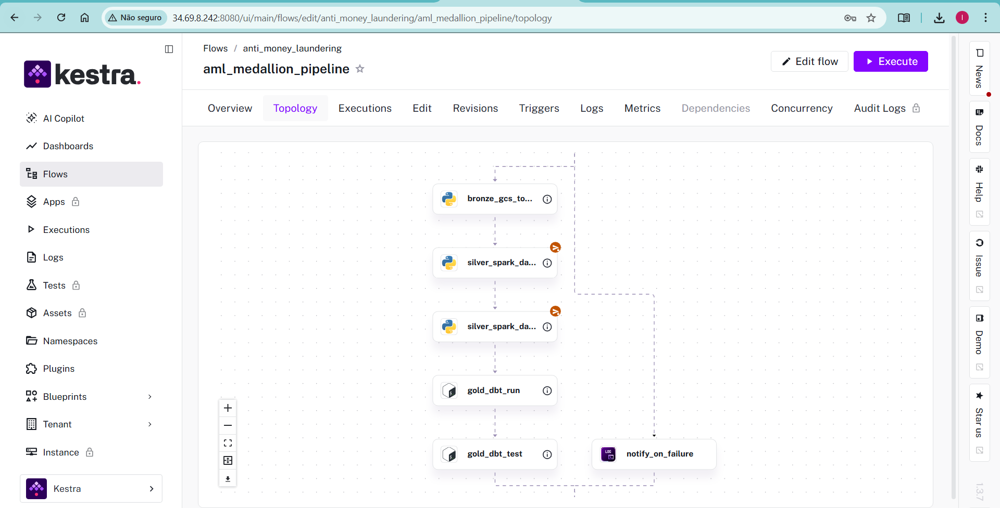
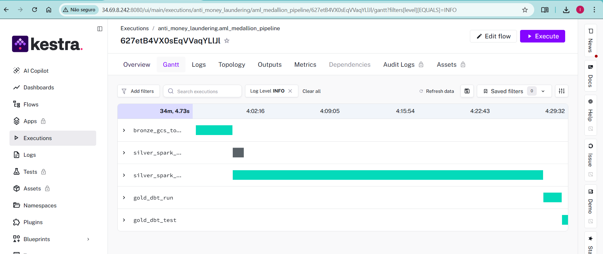
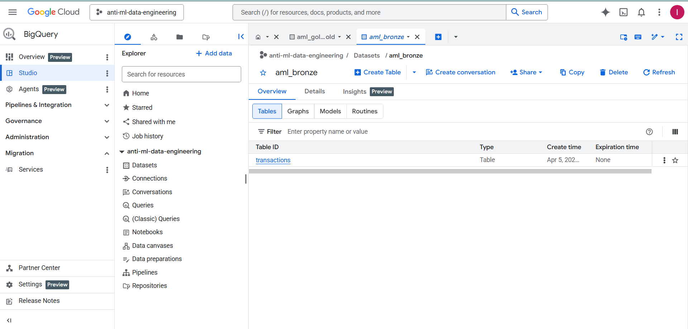
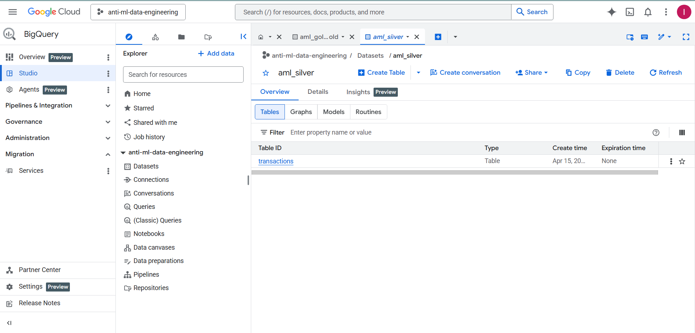
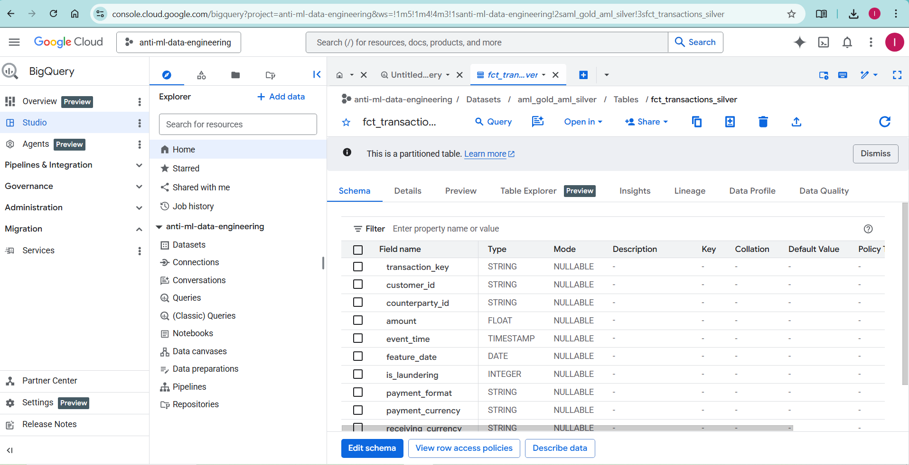
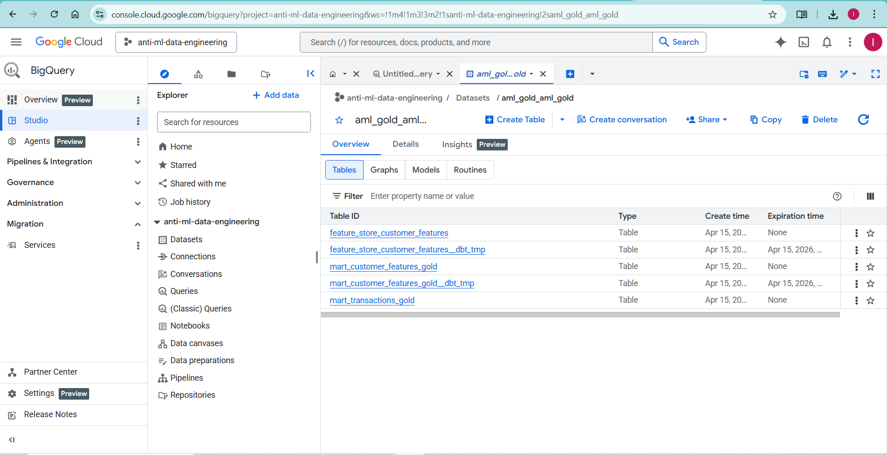
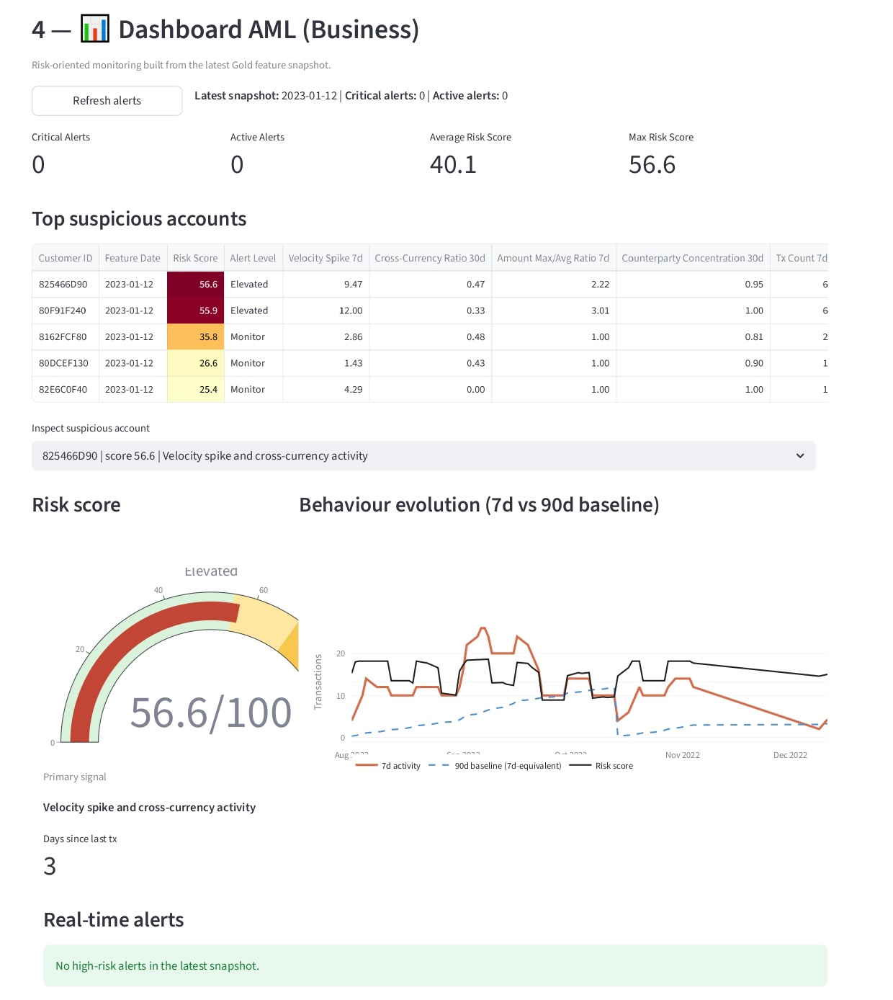
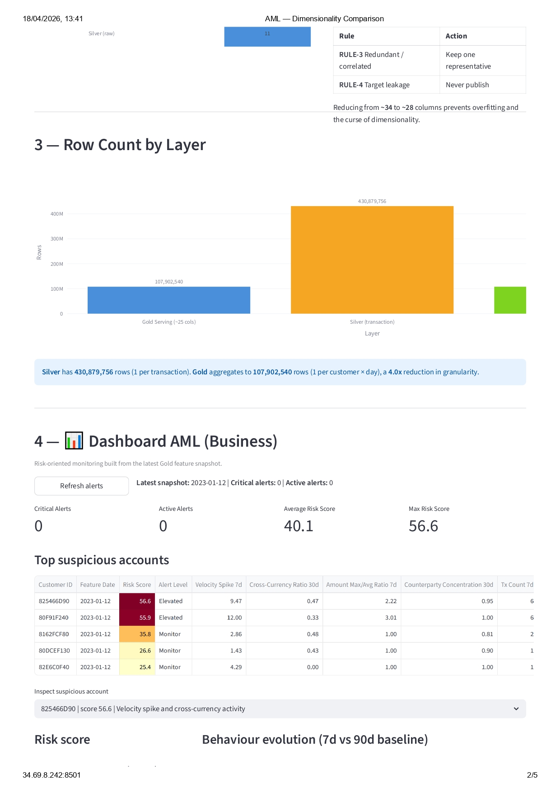
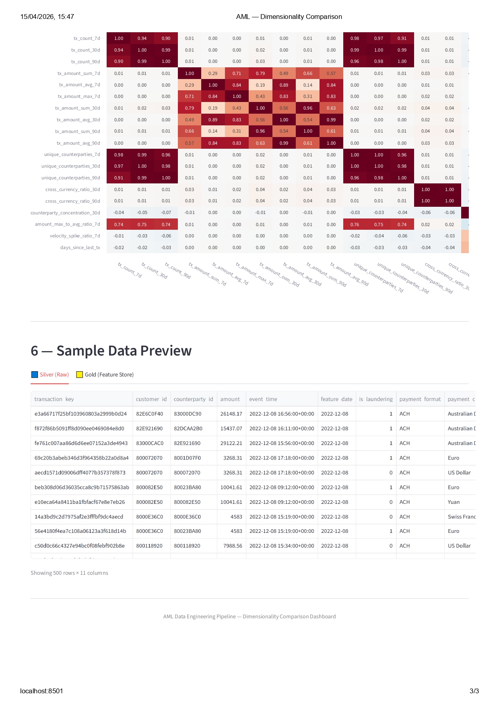

# Anti Money Laundering — Data Engineering Pipeline

A production-ready **Medallion Architecture** (Bronze / Silver / Gold) data pipeline for the [IBM Transactions for Anti Money Laundering (AML)](https://www.kaggle.com/datasets/ealtman2019/ibm-transactions-for-anti-money-laundering-aml) Kaggle dataset, orchestrated with **Kestra**, processed with **PySpark**, stored on **Google Cloud Storage** and **BigQuery**, and modelled with **dbt**.

The ingestion layer downloads the dataset from Kaggle to a temporary file on disk and **streams each CSV directly to GCS** via the Google Cloud Storage Python client — no persistent local files are kept. The Kestra pipeline then loads the CSVs from GCS into BigQuery (Bronze), runs PySpark for cleaning (Silver), and dbt for feature engineering (Gold).

The **Gold layer is a Feature Store** with temporal feature engineering (rolling windows), incremental materialisation, BigQuery partitioning/clustering, and rule-based feature selection — designed for AML model training and scoring.

---

## Table of Contents

1. [Architecture Overview](#architecture-overview)
2. [Pipeline Topology (Kestra)](#pipeline-topology-kestra)
3. [Pipeline Execution (Production)](#pipeline-execution-production)
4. [Project Structure](#project-structure)
5. [Gold Layer as Feature Store](#gold-layer-as-feature-store)
6. [Temporal Feature Engineering (Rolling Windows)](#temporal-feature-engineering-rolling-windows)
7. [Incremental Strategy (Silver & Gold)](#incremental-strategy-silver--gold)
8. [90-Day Lookback and Implications](#90-day-lookback-and-implications)
9. [BigQuery Partitioning & Clustering](#bigquery-partitioning--clustering)
10. [Feature Selection (Rule-Based)](#feature-selection-rule-based)
11. [Dimensionality per Layer & Quality Rules](#dimensionality-per-layer--quality-rules)
12. [Streamlit Dashboard](#streamlit-dashboard--dimensionality-comparison)
13. [Prerequisites](#prerequisites)
14. [Kaggle Token Setup](#kaggle-token-setup)
15. [GCP Authentication](#gcp-authentication)
16. [Provisioning Infrastructure (Terraform)](#provisioning-infrastructure-terraform)
17. [Starting Kestra (Docker Compose)](#starting-kestra-docker-compose)
18. [Running the Pipeline](#running-the-pipeline)
19. [Running dbt Incrementally](#running-dbt-incrementally)
20. [dbt Model Reference](#dbt-model-reference)
21. [Adding / Removing Features](#adding--removing-features)

---

## Architecture Overview

```
┌─────────────┐   stream to GCS   ┌───────────────────────────────────────────────────┐
│  Kaggle API │─────────────▶│  Bronze (GCS)                                     │
│  IBM AML    │  (temp disk)    │  gs://…-bronze/raw/*.csv                       │
└─────────────┘                 └───────────────────────┬───────────────────────────┘
                                                    │ Kestra: GCS → BigQuery Load
                                                    ▼
                  ┌───────────────────────────────────────────────────┐
                  │  Bronze (BigQuery)                                │
                  │  aml_bronze.transactions                          │
                  └─────────────────────────┬─────────────────────────┘
                                          │ PySpark (incremental)
                                          ▼
                  ┌───────────────────────────────────────────────────┐
                  │  Silver (BigQuery + GCS)                          │
                  │  aml_silver.transactions                          │
                  │  fct_transactions_silver  (dbt — typed/clean)     │
                  └───────────────────────┬───────────────────────────┘
                                          │ dbt (incremental, 90-day lookback)
                                          ▼
                  ┌───────────────────────────────────────────────────┐
                  │  Gold — Feature Store (BigQuery)                  │
                  │  aml_gold.mart_customer_features_gold             │
                  │      └─▶ aml_gold.feature_store_customer_features │
                  │  Grain: (customer_id, feature_date)               │
                  │  Partition: feature_date  │  Cluster: customer_id │
                  └───────────────────────────────────────────────────┘

Ingestion: kaggle_download.py (Kaggle → temp disk → GCS streaming)
Orchestration: Kestra (aml_medallion_pipeline flow)
Infrastructure: Terraform (GCS buckets + BigQuery datasets)
Manifest/checkpoint: aml_ops.ingestion_manifest (BigQuery)
```

### BigQuery Datasets

<p align="center">
  
</p>

---

## Pipeline Topology (Kestra)

The `aml_medallion_pipeline` flow orchestrates five sequential tasks with an error handler. Below is the DAG as rendered by Kestra:

```
                 ┌──────────────────────┐
                 │  bronze_gcs_to_bq    │  Step 1 — Load CSV from GCS → BigQuery
                 │  (Python Script)     │  aml_bronze.transactions
                 └──────────┬───────────┘
                            │
                 ┌──────────▼───────────┐
                 │  silver_spark_       │  Step 2a — PySpark via Dataproc Batches
                 │  dataproc_incremental│  Processes single partition_date
                 └──────────┬───────────┘
                            │
                 ┌──────────▼───────────┐
                 │  silver_spark_       │  Step 2b — PySpark via Dataproc Batches
                 │  dataproc_full_      │  Full refresh (all partitions)
                 │  refresh             │
                 └──────────┬───────────┘
                            │
                 ┌──────────▼───────────┐
                 │  gold_dbt_run        │  Step 3 — dbt run (feature models)
                 │  (Shell Commands)    │  fct_transactions_silver →
                 │                      │  mart_customer_features_gold →
                 │                      │  feature_store_customer_features
                 └──────────┬───────────┘
                            │
                 ┌──────────▼───────────┐
                 │  gold_dbt_test       │  Step 4 — dbt test (data quality)
                 │  (Shell Commands)    │  Schema + custom tests on Gold models
                 └──────────────────────┘

          ┌────────────────────────────────┐
          │  notify_on_failure (error)     │  Logs failure details if any task
          │  (Log)                         │  in the pipeline fails
          └────────────────────────────────┘
```

| Task | Plugin | Layer | Description |
|---|---|---|---|
| `bronze_gcs_to_bq` | `scripts.python.Script` | Bronze | Loads `gs://<bucket>/raw/*.csv` (or `partitions/<date>`) into BigQuery via `LoadJobConfig` |
| `silver_spark_dataproc_incremental` | `gcp.dataproc.batches.PySparkSubmit` | Silver | Submits `clean_aml_data.py` to Dataproc Serverless for a single partition |
| `silver_spark_dataproc_full_refresh` | `gcp.dataproc.batches.PySparkSubmit` | Silver | Submits `clean_aml_data.py --full-refresh` to Dataproc Serverless |
| `gold_dbt_run` | `scripts.shell.Commands` | Gold | Runs `dbt run` on Silver → Gold models (incremental or `--full-refresh`) |
| `gold_dbt_test` | `scripts.shell.Commands` | Gold | Runs `dbt test` on Silver and Gold models |
| `notify_on_failure` | `core.log.Log` | — | Error handler: logs partition and run mode on failure |

### Flow Topology (Kestra UI)

<p align="center">
  
</p>

**Execution modes** (set via `run_mode` input):
- **`INCREMENTAL`** — Loads only `partitions/<date>/*.csv`, PySpark processes one partition, dbt merges 90-day window
- **`FULL_REFRESH`** — Loads all `raw/*.csv` with `WRITE_TRUNCATE`, PySpark reprocesses everything, dbt runs `--full-refresh`

---

## Pipeline Execution (Production)

The pipeline runs on a GCE VM (`kestra-server`, `e2-standard-4`) in `us-central1-a` with Kestra orchestrating all steps inside a Docker container.

### Successful End-to-End Run

**Execution `627etB4VX0sEqVVaqYLlJl`** — Flow revision 16, `FULL_REFRESH` mode (April 15, 2026):

<p align="center">
  
</p>

| Task | Status | Details |
|---|---|---|
| `bronze_gcs_to_bq` | ✅ SUCCESS | Loaded 5 CSV files → `aml_bronze.transactions` (WRITE_TRUNCATE) |
| `silver_spark_dataproc_full_refresh` | ✅ SUCCESS | PySpark on Dataproc Serverless Batches — 430.9M rows → `aml_silver.transactions` |
| `gold_dbt_run` | ✅ SUCCESS | dbt 1.8.2 `--full-refresh` — 4 models in 70s |
| `gold_dbt_test` | ✅ SUCCESS | 13 schema tests passed |

**Gold layer output (dbt run):**

| Model | Rows | Data Processed | Time |
|---|---|---|---|
| `fct_transactions_silver` | 430.9M | 33.0 GiB | 25s |
| `mart_transactions_gold` | 20.6M | 15.2 GiB | 10s |
| `mart_customer_features_gold` | 107.9M | 26.6 GiB | 32s |
| `feature_store_customer_features` | 107.9M | 24.6 GiB | 12s |

### Infrastructure

| Component | Details |
|---|---|
| **Kestra** | Docker container (`kestra-with-dbt:latest`) at `http://<VM_IP>:8080` |
| **dbt** | Installed inside Kestra container (v1.8.2 + dbt-bigquery 1.8.2) |
| **dbt project** | Mounted from host `/app/dbt` via Docker volume |
| **SA credentials** | Mounted from `/etc/docker/key.json` → `/app/secrets/key.json` (read-only) |
| **Streamlit Dashboard** | Docker container (`aml-dashboard`) at [`http://34.69.8.242:8501`](http://34.69.8.242:8501) |
| **Silver processing** | Dataproc Serverless Batches (12 vCPUs, auto-scaling) |
| **BigQuery datasets** | `aml_bronze`, `aml_silver`, `aml_gold`, `aml_ops` |

---

## Project Structure

```
.
├── ingestion/
│   ├── kaggle_download.py             # Download from Kaggle → stream to GCS (no local persistence)
│   └── upload_to_gcs.py               # Utility: manual upload of local files to GCS
├── spark/
│   └── clean_aml_data.py              # PySpark Silver layer (incremental)
├── kestra/
│   └── aml_pipeline.yaml              # Kestra orchestration flow
├── terraform/
│   ├── main.tf                        # GCS buckets + BigQuery datasets
│   ├── variables.tf
│   └── outputs.tf
├── dbt/
│   ├── dbt_project.yml                # Project config (incremental Gold defaults)
│   ├── profiles.yml.example           # Copy to ~/.dbt/profiles.yml
│   ├── macros/
│   │   └── rolling_window.sql         # Reusable rolling-window macro
│   └── models/
│       ├── schema.yml                 # Full model + column documentation
│       ├── bronze/
│       │   └── stg_transactions_bronze.sql
│       ├── silver/
│       │   ├── stg_transactions_silver.sql   (legacy)
│       │   └── fct_transactions_silver.sql   ← canonical Silver source
│       └── gold/
│           ├── mart_transactions_gold.sql            (legacy)
│           ├── mart_customer_features_gold.sql       ← feature compute layer
│           └── feature_store_customer_features.sql   ← feature serving layer
├── docker-compose.yml                 # Kestra + Postgres (local dev)
├── requirements.txt
├── .env.example
└── .gitignore
```

---

## Gold Layer as Feature Store

The Gold layer is treated as a **lightweight feature store** rather than a simple aggregation layer.

| Concept | Implementation |
|---|---|
| **Entity** | `customer_id` (sender of the transaction) |
| **Time key** | `feature_date` = `DATE(timestamp)` |
| **Grain** | One row per `(customer_id, feature_date)` |
| **Versioning** | `feature_version` column (e.g. `'1.0'`) in every row |
| **Lineage** | `source_model` column records which dbt model produced the row |
| **Freshness** | `feature_created_at` timestamp on every row |
| **Serving table** | `aml_gold.feature_store_customer_features` |
| **Compute table** | `aml_gold.mart_customer_features_gold` |

The two-layer approach (compute → serving) lets you:
- Compute all candidate features in `mart_customer_features_gold`
- Publish only approved features in `feature_store_customer_features` after rule-based selection
- Evolve features without breaking downstream consumers

---

## Temporal Feature Engineering (Rolling Windows)

Instead of static per-customer aggregations, the Gold layer models **behaviour over time** using rolling windows anchored on `feature_date`.

| Feature group | Windows | AML signal |
|---|---|---|
| **Frequency** (`tx_count_*d`) | 7 / 30 / 90 days | Velocity of activity |
| **Monetary sum** (`tx_amount_sum_*d`) | 7 / 30 / 90 days | Volume of funds moved |
| **Monetary avg/max** | 7 / 30 / 90 days | Structuring detection |
| **Counterparty diversity** (`unique_counterparties_*d`) | 7 / 30 / 90 days | Fan-out / layering |
| **Cross-currency count & ratio** | 30 / 90 days | Jurisdiction hopping |
| **Payment-format diversity** | 90 days | Multi-rail obfuscation |
| **Recency** (`days_since_last_tx`) | — | Dormancy / burst patterns |
| **Velocity spike ratio** | 7d vs 30d avg | Sudden activity bursts |
| **Amount max/avg ratio** | 7 days | Single large transaction vs baseline |
| **Counterparty concentration** | 30 days | Few counterparties, many transactions |

Windows are implemented with a reusable dbt macro (`macros/rolling_window.sql`) that emits BigQuery `RANGE BETWEEN` window functions anchored on `unix_date(feature_date)` — correctly handling gaps in the daily time series.

---

## Incremental Strategy (Silver & Gold)

### Bronze → Silver (PySpark)

- Raw CSV files are stored in GCS under `gs://<bronze-bucket>/raw/` (full-refresh) or `gs://<bronze-bucket>/partitions/YYYY-MM-DD/` (incremental).
- The ingestion script (`ingestion/kaggle_download.py`) downloads the Kaggle zip to a temporary file on disk, then **streams each CSV directly to GCS** via `blob.upload_from_file()` — no persistent local files are kept. The temp zip is deleted automatically.
- The Kestra pipeline starts by loading CSVs from GCS into BigQuery (`aml_bronze.transactions`) using a BigQuery Load Job.
- The Spark job (`spark/clean_aml_data.py`) accepts `--partition-date YYYY-MM-DD` and processes only that prefix.
- A **manifest table** (`aml_ops.ingestion_manifest`) in BigQuery records each successfully processed partition, preventing double-processing.
- Kestra passes `inputs.partition_date` (defaulting to yesterday) to the Spark job at runtime.

**Full-refresh** (one-time or recovery):
```bash
spark-submit spark/clean_aml_data.py --full-refresh
```

**Incremental** (daily, via Kestra or manually):
```bash
spark-submit spark/clean_aml_data.py --partition-date 2024-03-15
```

### Silver → Gold (dbt)

The Gold models are `materialized='incremental'` with `incremental_strategy='merge'` and `unique_key=['customer_id', 'feature_date']`.

On each incremental run, **only the last 90 days are recomputed**:

```sql
-- Applied automatically in mart_customer_features_gold when is_incremental()
where feature_date >= date_sub(
    (select max(feature_date) from {{ this }}),
    interval 90 day
)
```

This avoids a full historical recomputation while ensuring all rolling windows (up to 90 days) remain accurate for newly arrived data.

---

## 90-Day Lookback and Implications

The **90-day lookback** is the standard AML monitoring window recommended by FATF/FinCEN for suspicious activity reporting.

**Why 90 days?**
- The longest rolling window feature is `tx_count_90d`, `tx_amount_sum_90d`, etc.
- When new transactions arrive for date `T`, the feature values for dates `T-89` through `T` may be affected.
- Re-processing only the 90-day window is the minimal correct recomputation.

**Storage implications:**
- Each incremental dbt run merges ~90 days × N customers rows into the Gold table.
- BigQuery partition pruning (on `feature_date`) ensures only affected partitions are scanned/updated.
- Older partitions are never touched unless a `--full-refresh` is explicitly requested.

**Choosing a different lookback:**
- Change the `interval 90 day` in both `mart_customer_features_gold.sql` and `feature_store_customer_features.sql`.
- Ensure the window size matches the longest rolling window feature you compute.

---

## BigQuery Partitioning & Clustering

All Gold models are configured with explicit BigQuery optimisations in `dbt_project.yml` (and overridable per model):

```yaml
# dbt/dbt_project.yml
gold:
  +partition_by:
    field: feature_date
    data_type: date
    granularity: day
  +cluster_by:
    - customer_id
```

| Setting | Value | Benefit |
|---|---|---|
| `partition_by` | `feature_date` (DATE) | Prunes old partitions on incremental merge; cheaper queries filtered by date |
| `cluster_by` | `customer_id` | Speeds up single-customer lookups from scoring jobs |

**Cost estimate**: With partitioning, a query filtering `WHERE feature_date = '2024-03-15'` scans only one day's data regardless of historical size.

---

## Feature Selection (Rule-Based)

The `feature_store_customer_features` model is the **selection layer** — it applies four explainable rules before publishing features to consumers:

| Rule | Description | Example exclusion |
|---|---|---|
| **RULE-1** (Null threshold) | Features with expected null-rate > 30% are coalesced to a sentinel value or excluded | `days_since_last_tx` → coalesced to `-1` on first day |
| **RULE-2** (Low variance) | Features that are trivially constant add no signal | Raw 1-day amount std excluded in favour of rolling equivalents |
| **RULE-3** (Redundancy) | Highly correlated features are reduced to one representative | Ratio features capture the relationship; raw pairs may be dropped |
| **RULE-4** (Leakage) | Target / label columns are never published | `is_laundering` excluded from all feature store outputs |

### Adding a new feature

1. Compute it in `mart_customer_features_gold.sql` (add to the appropriate CTE).
2. Add it to the SELECT in `feature_store_customer_features.sql` with a comment stating which rule it passes.
3. Document it in `dbt/models/schema.yml` under both models.
4. Run `dbt run --select mart_customer_features_gold feature_store_customer_features`.

### Removing a feature

1. Remove it from the SELECT in `feature_store_customer_features.sql`.
2. Mark it as deprecated in `schema.yml` with removal date and reason.
3. Optionally remove the computation from `mart_customer_features_gold.sql` after a deprecation period.

---

## Dimensionality per Layer & Quality Rules

This section documents the schema (columns) of each layer, the grain, and the quality rules applied at every stage of the pipeline. Controlling dimensionality is critical for downstream ML — excessive features cause the **Curse of Dimensionality** (sparse data, overfitting, increased compute cost) while too few features lose predictive signal.

### Bronze — Raw Source

<p align="center">
  
</p>

| Property | Value |
|---|---|
| **Table** | `aml_bronze.transactions` |
| **Grain** | One row per raw CSV record (no deduplication) |
| **Materialization** | `view` (dbt) / BigQuery Load Job (Kestra) |
| **Columns** | All original Kaggle columns as-is (no transformations) |
| **Quality rules** | None — this layer is an immutable landing zone |

### Silver — Cleaned & Typed

<p align="center">
  
</p>

<p align="center">
  
</p>

| Property | Value |
|---|---|
| **Table** | `aml_silver.fct_transactions_silver` |
| **Grain** | One row per unique transaction (`transaction_key` = MD5 of natural key) |
| **Materialization** | `incremental` (merge on `transaction_key`) |
| **Columns (11)** | `transaction_key`, `customer_id`, `counterparty_id`, `amount`, `event_time`, `feature_date`, `is_laundering`, `payment_format`, `payment_currency`, `receiving_currency`, `_ingested_at` |

**Quality rules applied:**

| Rule | Implementation | Purpose |
|---|---|---|
| Null rejection | `WHERE account2 IS NOT NULL AND account4 IS NOT NULL AND timestamp IS NOT NULL` | Drop records missing critical identifiers |
| Non-positive amounts | `WHERE amount_received > 0` | Remove zero/negative transactions |
| Deduplication | `ROW_NUMBER() OVER (PARTITION BY account2, account4, amount_received, timestamp ORDER BY _ingested_at DESC)` | Keep only the most recent ingestion of each transaction |
| Safe defaults | `COALESCE(NULLIF(TRIM(payment_format), ''), 'UNKNOWN')` | Prevent nulls in categorical columns |
| Explicit type casting | `CAST(amount_received AS FLOAT64)`, `CAST(timestamp AS TIMESTAMP)` | Enforce type safety |
| Schema tests (dbt) | `not_null` on `transaction_key`, `customer_id`, `counterparty_id`, `amount`, `event_time`, `feature_date`; `unique` on `transaction_key` | Validate constraints on every `dbt test` run |

> **PySpark upstream** (`spark/clean_aml_data.py`) also applies column normalisation, `dropDuplicates()`, null drops on critical fields, positive-amount filter, type casting, and `_ingested_at` metadata — providing defence-in-depth before data reaches dbt.

### Gold — Feature Store (Compute Layer)

<p align="center">
  
</p>

| Property | Value |
|---|---|
| **Table** | `aml_gold.mart_customer_features_gold` |
| **Grain** | `(customer_id, feature_date)` — one row per customer per day |
| **Materialization** | `incremental` (merge, 90-day lookback) |
| **Columns (~40)** | 1-day raw aggregates + 7/30/90-day rolling windows + derived ratios + metadata |

| Feature group | Columns | Windows |
|---|---|---|
| Transaction count | `tx_count_1d`, `tx_count_7d`, `tx_count_30d`, `tx_count_90d` | 1/7/30/90d |
| Amount sum | `tx_amount_sum_1d`, `tx_amount_sum_7d`, `tx_amount_sum_30d`, `tx_amount_sum_90d` | 1/7/30/90d |
| Amount avg | `tx_amount_avg_1d`, `tx_amount_avg_7d`, `tx_amount_avg_30d`, `tx_amount_avg_90d` | 1/7/30/90d |
| Amount max | `tx_amount_max_1d`, `tx_amount_max_7d`, `tx_amount_max_30d`, `tx_amount_max_90d` | 1/7/30/90d |
| Amount min/std | `tx_amount_min_1d`, `tx_amount_std_1d` | 1d only |
| Counterparty diversity | `unique_counterparties_1d/7d/30d/90d` | 1/7/30/90d |
| Cross-currency count | `cross_currency_tx_count_1d/7d/30d/90d` | 1/7/30/90d |
| Currency diversity | `unique_payment_currencies_1d/30d/90d` | 1/30/90d |
| Payment format diversity | `unique_payment_formats_1d/90d` | 1/90d |
| Recency | `days_since_last_tx` | — |
| Derived ratios | `cross_currency_ratio_30d/90d`, `counterparty_concentration_30d`, `amount_max_to_avg_ratio_7d`, `velocity_spike_ratio_7d` | — |
| Metadata | `feature_version`, `source_model`, `feature_created_at` | — |

### Gold — Feature Store (Serving Layer)

| Property | Value |
|---|---|
| **Table** | `aml_gold.feature_store_customer_features` |
| **Grain** | `(customer_id, feature_date)` |
| **Materialization** | `incremental` (merge, 90-day lookback) |
| **Columns (~25)** | Curated subset published after rule-based selection |

**Feature selection rules — why ~40 columns are reduced to ~25:**

| Rule | Criteria | Action | Example |
|---|---|---|---|
| **RULE-1** — Null threshold | Feature null-rate > 30% in cold-start scenarios | Exclude or coalesce to sentinel value | `days_since_last_tx` → `COALESCE(..., -1)` on first active day |
| **RULE-2** — Low variance | Trivially constant for single-transaction days | Exclude in favour of rolling equivalents | `tx_amount_min_1d`, `tx_amount_std_1d` dropped |
| **RULE-3** — Redundancy | Highly correlated feature pairs | Keep one representative | `amount_max_to_avg_ratio_7d` captures the max ↔ avg relationship |
| **RULE-4** — Leakage prevention | Target / label columns | **Never** published | `is_laundering` excluded from all outputs |

> **Why this matters for ML:** Publishing ~25 curated features (instead of ~40 raw ones) reduces the curse of dimensionality, prevents overfitting, speeds up model training, and removes collinear inputs that destabilise linear models — while retaining the key AML signals (RFM, cross-currency, velocity spikes).

### Gold — Transaction Aggregation

| Property | Value |
|---|---|
| **Table** | `aml_gold.mart_transactions_gold` |
| **Grain** | `(customer_id, counterparty_id)` — one row per sender-receiver pair |
| **Materialization** | `incremental` (merge, 90-day lookback) |
| **Columns (9)** | `customer_id`, `counterparty_id`, `transaction_count`, `total_amount`, `avg_amount`, `min_amount`, `max_amount`, `first_transaction_at`, `last_transaction_at` |

### Summary: Dimensionality Progression

```
Bronze (raw)  ──▶  Silver (11 cols)  ──▶  Gold compute (~40 cols)  ──▶  Gold serving (~25 cols)
   no rules         6 quality rules        rolling-window expansion      4 selection rules
   all records      deduplicated           (customer_id, date) grain     curated for ML
```

### Streamlit Dashboard — Dimensionality Comparison

A Streamlit dashboard is deployed alongside Kestra on the same VM to visualize the dimensionality progression across layers.

> **Live:** [http://34.69.8.242:8501](http://34.69.8.242:8501)

<p align="center">
  
</p>

<p align="center">
  
</p>

<p align="center">
  
</p>

---

## Prerequisites

| Tool | Version | Purpose |
|---|---|---|
| Python | ≥ 3.9 | Scripts + dbt |
| Docker & Docker Compose | ≥ 24 | Kestra local |
| Terraform | ≥ 1.5 | GCP provisioning |
| `gcloud` CLI | any | GCP auth |
| Apache Spark | ≥ 3.4 | Silver job |
| dbt-bigquery | ≥ 1.7 | Gold models |
| Kaggle account | — | Dataset download |

Install Python dependencies:
```bash
pip install -r requirements.txt
```

---

## Kaggle Token Setup

1. Go to [kaggle.com/settings](https://www.kaggle.com/settings) → **API** → **Create New Token** → downloads `kaggle.json`.
2. Place it at `~/.config/kaggle/kaggle.json` (Linux/Mac) or `%USERPROFILE%\.kaggle\kaggle.json` (Windows).
3. Or set environment variables:
   ```bash
   export KAGGLE_USERNAME=your_username
   export KAGGLE_KEY=your_api_key
   ```

---

## GCP Authentication

```bash
# Option A: user credentials (local dev)
gcloud auth application-default login

# Option B: service account (CI/production)
export GOOGLE_APPLICATION_CREDENTIALS=/path/to/service-account.json
```

Copy `.env.example` to `.env` and fill in your values:
```bash
cp .env.example .env
```

---

## Provisioning Infrastructure (Terraform)

```bash
cd terraform
terraform init
terraform plan -var="project_id=anti-ml-data-engineering"
terraform apply -var="project_id=anti-ml-data-engineering"
```

Resources created:
- `anti-ml-data-engineering-bronze` (GCS bucket)
- `anti-ml-data-engineering-silver` (GCS bucket)
- `anti-ml-data-engineering-artifacts` (GCS bucket — Spark temp)
- `aml_bronze`, `aml_silver`, `aml_gold`, `aml_ops` (BigQuery datasets)

---

## Starting Kestra (Docker Compose)

```bash
docker compose up -d
```

Open [http://localhost:8080](http://localhost:8080) and import the flow:
1. Go to **Flows** → **Create**.
2. Paste or upload `kestra/aml_pipeline.yaml`.

Configure secrets in Kestra UI (**Settings → Secrets**):
- `GCP_SA_KEY_PATH`
- `GCP_SA_EMAIL`
- `GCS_ARTIFACTS_BUCKET`

---

## Running the Pipeline

### Via Kestra UI

1. Open the `aml_medallion_pipeline` flow.
2. Click **Execute**.
3. Set inputs:
   - `partition_date`: `YYYY-MM-DD` (default: yesterday)
   - `run_mode`: `INCREMENTAL` or `FULL_REFRESH`

> **Pre-requisite**: Upload CSVs to GCS before running the pipeline (see step 1 below).
> The Kestra pipeline starts from GCS → BigQuery (it does **not** download from Kaggle).

### Manually (step by step)

```bash
# 1. Download from Kaggle and stream directly to GCS Bronze bucket
#    (downloads zip to temp file on disk, streams each CSV to GCS, deletes temp)
python ingestion/kaggle_download.py

# 2. Load CSVs from GCS into BigQuery Bronze (done automatically by Kestra,
#    or manually via bq CLI):
bq load --source_format=CSV --autodetect --skip_leading_rows=1 \
  anti-ml-data-engineering:aml_bronze.transactions \
  'gs://anti-ml-data-engineering-bronze/raw/*.csv'

# 3. Run Spark Silver job (incremental for a specific date)
spark-submit \
  --packages com.google.cloud.spark:spark-bigquery-with-dependencies_2.12:0.34.0 \
  spark/clean_aml_data.py --partition-date 2024-03-15

# 4. Run dbt Gold (incremental)
cd dbt && dbt run --select fct_transactions_silver+ 

# 5. Run dbt tests
dbt test --select fct_transactions_silver mart_customer_features_gold feature_store_customer_features
```

---

## Running dbt Incrementally

**First run (full history):**
```bash
cd dbt
dbt run --full-refresh --select fct_transactions_silver mart_customer_features_gold feature_store_customer_features
```

**Daily incremental run (only processes changed data, 90-day window):**
```bash
cd dbt
dbt run --select fct_transactions_silver mart_customer_features_gold feature_store_customer_features
```

**Run a single model:**
```bash
dbt run --select mart_customer_features_gold
```

**Run with a specific target date** (useful for backfills — Silver side):
```bash
spark-submit spark/clean_aml_data.py --partition-date 2024-01-15
dbt run --select mart_customer_features_gold feature_store_customer_features
```

---

## dbt Model Reference

| Model | Layer | Grain | Materialization | Notes |
|---|---|---|---|---|
| `stg_transactions_bronze` | Bronze | transaction | view | Thin passthrough |
| `stg_transactions_silver` | Silver | transaction | table | Legacy; use `fct_transactions_silver` |
| `fct_transactions_silver` | Silver | transaction | incremental (merge) | Canonical typed Silver source |
| `mart_transactions_gold` | Gold | (customer_id, counterparty_id) | incremental (merge) | Transaction pair aggregation |
| `mart_customer_features_gold` | Gold | (customer_id, feature_date) | incremental | Full feature computation |
| `feature_store_customer_features` | Gold | (customer_id, feature_date) | incremental | Published feature store (rule-selected) |

---

## Licence

MIT
